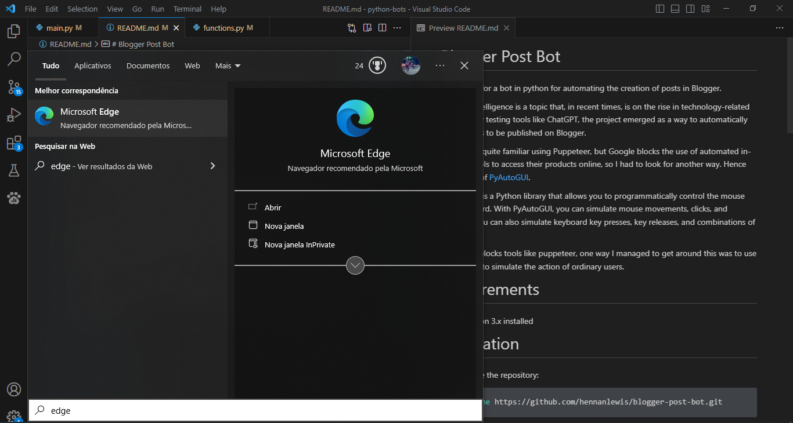
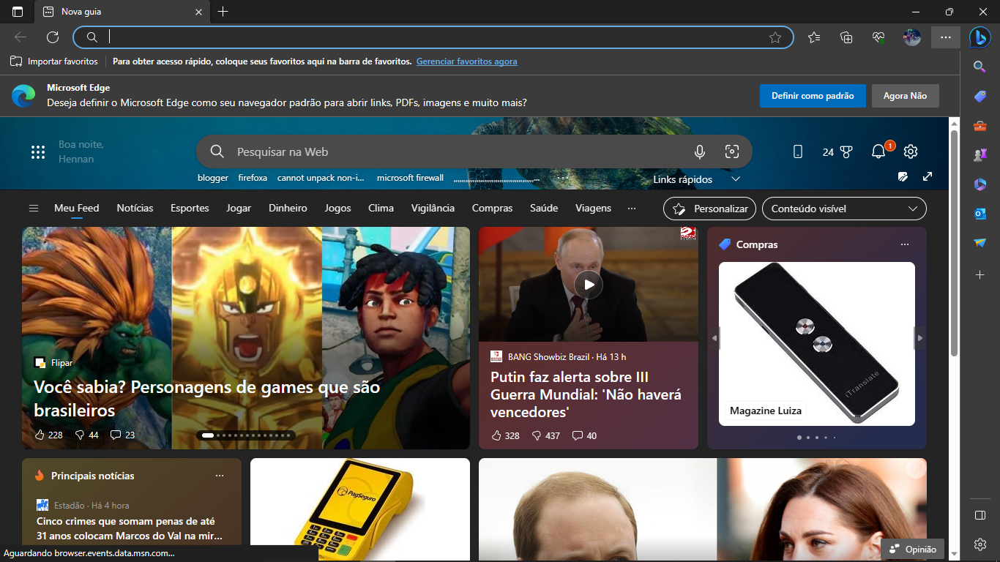
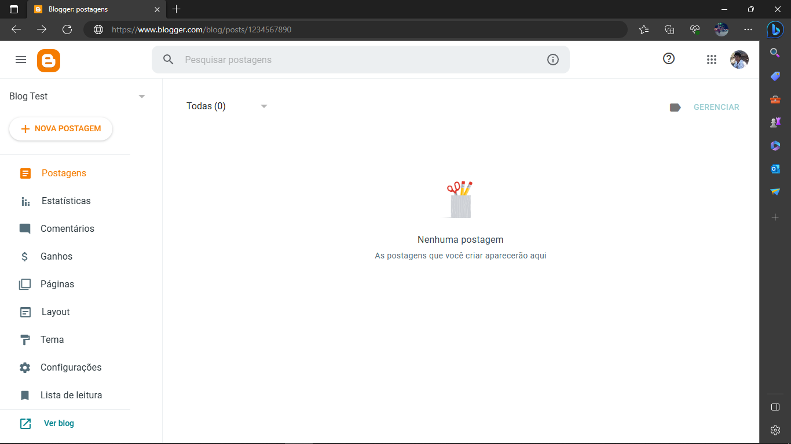
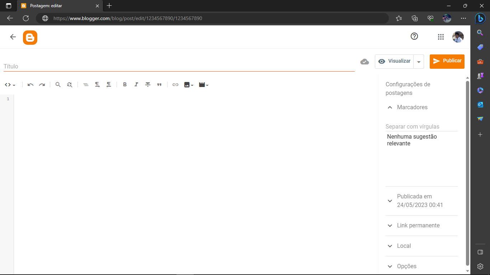

# Blogger Post Bot

Repository for a bot in python for automating the creation of posts in Blogger.

Artificial intelligence is a topic that, in recent times, is on the rise in technology-related topics. After testing tools like ChatGPT, the project emerged as a way to automatically create posts to be published on Blogger.

I'm already quite familiar using Puppeteer, but Google blocks the use of automated in-browser tools to access their products online, so I had to look for another way. Hence the choice of [PyAutoGUI](https://pyautogui.readthedocs.io/en/latest/).

PyAutoGUI is a Python library that allows you to programmatically control the mouse and keyboard. With PyAutoGUI, you can simulate mouse movements, clicks, and scrolling. You can also simulate keyboard key presses, key releases, and combinations of keys.

As google blocks tools like puppeteer, one way I managed to get around this was to use PyAutoGUI to simulate the action of ordinary users.

# Requirements

- Python 3.x installed

# Installation

1. Clone the repository:

```shell
git clone https://github.com/hennanlewis/blogger-post-bot.git
```

Navigate to the project directory:

```shell
cd blogger-auto-post-creator
```

Set up a virtual environment (optional but recommended):

```shell
python -m venv environmentname
source venv/bin/activate
```

Install the required dependencies:

```shell
pip install -r requirements.txt
```

# Usage

Run the bot script:
```shell
python main.py
```

The robot will display a CLI to configure some parameters.

The first one is the browser selection. The second one is the range of the number of chapters to be inserted.

> Note 1: the maximum daily number of posts allowed by Blogger for creation is 101

Based on this initial information, the bot starts the action:
1. Opens the start menu;
2. Searches for the selected browser;
   
3. Waits for the window to load;
4. Opens the selected link;
	
5. Initiates the process of creating chapters sequentially according to the inserted range.
	
	

# Limitations and Precautions
The provided links should already be logged into the browser before the bot starts its actions.

Create a `.env` file with the environment variable `BLOG_LINKS` at the same leval as `main.py` file. The text inside this file should follow the following pattern:

```properties
BLOG_LINKS=https://www.blogger.com/blog/posts/1234567890
```

This link is the initial author page from the blog to create the posts.

If you want to include multiple links to select from, separate them by commas like this:

```properties
BLOG_LINKS=https://www.blogger.com/blog/posts/1234567890,https://www.blogger.com/blog/posts/2345678901,https://www.blogger.com/blog/posts/3456789012
```

Trying to interact with the mouse or keyboard during the bot's operation will be like a tug-of-war, as the bot will continuously attempt to execute its function while the Blogger page is open. So, just let the bot do its job.

If for any reason you need to use your computer while the bot is running, you can execute the code within a virtual machine. On Windows, you can convert your code into an executable using the PyInstaller library and run it within the Windows Sandbox.

For more information on creating an executable from a Python code, refer to [this link](https://pyinstaller.org/en/stable/).

For more information on using the Windows Sandbox, refer to [this vídeo](https://www.youtube.com/watch?v=HRxbBCGQPR0).

Remember that when doing this, the `images` folder should be at the same level as the generated binary file.

> Note 2: My monitor has a resolution of 1366x768 and is 19 inches. I'm 99% sure that your monitor has different settings, so before reporting any errors or malfunctions, please modify the images in the `images` folder to match what appears on your monitor. Don't be lazy, there are only 6 images to adjust for each browser.

# Logs

After each execution or code crash, a log of actions is created in the `log` folder.


# Contributing

Contributions are welcome! If you would like to contribute to this project, please follow these steps:

1. Fork the repository
1. Create a new branch
1. Make your changes
1. Submit a pull request

# License

This project is licensed under the MIT License.